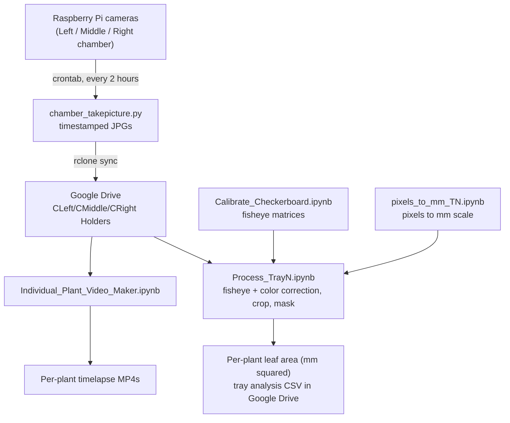

# Plant Chamber Imaging & Analysis Pipeline

A camera-to-data pipeline for tracking plant growth in the Ecker Lab (Salk Institute). Raspberry Pi cameras photograph trays of *Arabidopsis thaliana* (Col-0 and Salk T-DNA lines) inside a growth chamber on a fixed schedule. The images sync to Google Drive, where a set of JupyterLab notebooks correct, crop, and segment them with [PlantCV](https://plantcv.org/), measure each plant's leaf area over time, convert pixels to mm², and render per-plant timelapse videos.

The repository holds **code and configuration only**. Raw images live in Google Drive (not in git), so a fresh clone is small.

---

## How it works



At a glance, the pipeline has four stages:

1. **Capture** — Pi cameras save timestamped photos and sync them to Google Drive.
2. **Calibrate** — one-time per tray: correct camera fisheye distortion and establish the pixels-to-mm² scale from a known-size reference square.
3. **Process** — for each tray, a notebook masks the plants, defines a region of interest per plant, measures pixel area, converts to mm², attaches genotype names, and appends the results to a CSV.
4. **Visualize** — build cropped timelapse videos of individual plants across the experiment.

---

## Repository map

| Path | What it is |
| --- | --- |
| `config/paths.py` | Central path configuration. **Every machine edits the two base paths at the top** (`GITHUB_REPO_PATH`, `GOOGLE_DRIVE_FOLDER_PATH`); everything else is derived from them. |
| `On_Pi/` | Raspberry Pi capture code. `Chamber_Pi/Chamber_{Left,Middle,Right}/` each hold `chamber_takepicture.py` (routine capture), `tray*_take_calibration_picture.py`, `capture_fisheye_calibration_checkerboard.py`, and `delete_todays_images.py`. `Desktop_Pi/` is the separate desktop imaging rig. |
| `On_Laptop/Chamber/` | Main analysis workspace (runs on the laptop). |
| `On_Laptop/Chamber/Camera_{Left,Middle,Right}_Calibration/` | `Calibrate_Checkerboard.ipynb` — computes fisheye correction matrices for each camera. |
| `On_Laptop/Chamber/Current Experiment/Tray1…Tray8/` | Per-tray processing. Each tray has `Process_TrayN.ipynb`, a `Pixels_to_mm_TN/` calibration notebook, and `plant_names_tN.csv`. |
| `On_Laptop/Chamber/Process_all_Chamber*.py`, `Process_Whole_Chamber.py` | Batch drivers that process every tray in one run. |
| `On_Laptop/Chamber/Individual_Plant_Video_Maker.ipynb` | Builds per-plant timelapse MP4s from a run of images. |
| `On_Laptop/Desktop/` | Processing for the desktop imaging setup (parallel to the chamber workflow). |
| `crontab_controls.md` | Guide to scheduling automatic captures on the Pi with cron. |
| `requirements.txt` | Pinned Python environment. |

The eight trays are split across the three cameras: Trays 1–3 (Left), 4–5 (Middle), 6–8 (Right).

---

## Setup

Requires Python 3 and, on the imaging machines, a Raspberry Pi with the `picamera2` stack.

```bash
git clone https://github.com/kyle1686/eckerlabproj.git
cd eckerlabproj
python3 -m venv plant_env
source plant_env/bin/activate
pip install -r requirements.txt
```

Then open `config/paths.py` and set the two base paths for your machine:

```python
GITHUB_REPO_PATH        = '/path/to/eckerlabproj'
GOOGLE_DRIVE_FOLDER_PATH = '/path/to/your/Google Drive/My Drive'
```

The notebooks are built for JupyterLab and use interactive Matplotlib (`%matplotlib widget`, provided by `ipympl`). Launch with `jupyter lab`.

---

## Running the pipeline

### 1. Capture (on the Raspberry Pi)

Each chamber camera runs on its own Pi. Routine capture is handled by `chamber_takepicture.py`, scheduled with cron. Images are taken about every 2 hours during the light period (9 AM to 5 PM). For example:

```
0 9-17/2 * * * /usr/bin/python3 /home/user/eckerlabproj/On_Pi/Chamber_Pi/Chamber_Left/chamber_takepicture.py
```

See `crontab_controls.md` for a full walkthrough of editing and checking cron jobs. Images are saved with timestamped names (`ChamberLeft_image_YYYY-MM-DD--HH-MM.jpg`) and synced to Google Drive with rclone.

### 2. Calibrate (once per tray)

Before processing a new experiment, run the two calibration steps:

- **Fisheye correction** — `Camera_{Left,Middle,Right}_Calibration/Calibrate_Checkerboard.ipynb` uses checkerboard photos to compute distortion matrices (`mtx.npz`). On macOS, delete any `.DS_Store` files in the image folder first, or PlantCV's checkerboard step errors.
- **Pixel-to-mm scale** — `Current Experiment/TrayN/Pixels_to_mm_TN/pixels_to_mm_TN.ipynb` photographs a known-size square (e.g. a printed grid) and saves the mm-per-pixel scale to `TrayN_scale_values.json`.

### 3. Process a tray

Open `Current Experiment/TrayN/Process_TrayN.ipynb` and run the cells top to bottom. Each notebook:

1. Loads the latest image for that tray from Google Drive.
2. Applies fisheye correction, color correction, rotation, and crop.
3. Masks plant tissue, then defines one region of interest per plant.
4. Measures each plant's pixel area and converts it to mm² using the tray's scale value.
5. Looks up genotype names from `plant_names_tN.csv` and appends a row per plant to that tray's analysis CSV in Google Drive (`Chamber/Final_Data/trayN_analysis_log.csv`).
6. Moves the processed image into a holder folder so it is not re-counted.

To process every tray in one shot, run `Process_Whole_Chamber.py`. Run the scale calibration first, or the mm² conversion will be missing.

### 4. Make timelapse videos

`Individual_Plant_Video_Maker.ipynb` turns a run of images into cropped per-plant MP4s. You define time segments, each with its own crop box `(x1, y1, x2, y2)`, export frames, and render the video with `imageio` + `ffmpeg`.

A few working notes baked into this notebook: segment end indices are **exclusive** (consecutive segments share a boundary so no frames are skipped), sort plant labels by their integer (`plant7` before `plant17`), and pass `macro_block_size=1` to `imageio.mimsave` to stop silent frame resizing. Red `ffmpeg` output during rendering is normal, not an error.

---

## Hardware & data layout

**Cameras.** Three Raspberry Pi units, one per chamber position (Left, Middle, Right), each capturing with `picamera2`. Capture is fully automated through cron; the Pi only needs power, network, and the synced Google Drive remote.

**Storage.** Images are never committed to git. Each Pi writes to a local holder folder that rclone syncs to a Google Drive remote (`gdrive:Chamber/CLeft_Holder`, etc.). The laptop reads those same folders locally through the Google Drive desktop app. Repo-tracked outputs are limited to small JSON scale files, `plant_names` CSVs, and the notebooks themselves. Final per-tray analysis CSVs are written back to `Chamber/Final_Data/` in Google Drive.

**Filenames.** Images use a sortable timestamp, `Chamber{Position}_image_YYYY-MM-DD--HH-MM.jpg`, which is what the processing and video notebooks rely on to order frames in time.

---

## Conventions & tips

- **One config source.** Never hard-code paths in a notebook; add them to `config/paths.py` and import `config.paths`. Each machine only changes the two base paths at the top.
- **Zero-area plants** (fully occluded or not yet germinated) are skipped rather than logged as 0.
- **Resuming a run.** Processing appends to the analysis CSV, so a crashed run can be restarted without duplicating rows as long as processed images have been moved to their holder.

---

*Maintained by the Ecker Lab. Questions about a specific step are usually answered by the comments in the relevant notebook.*
