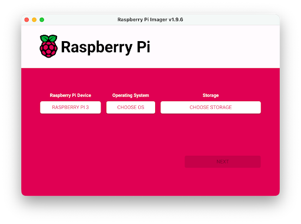
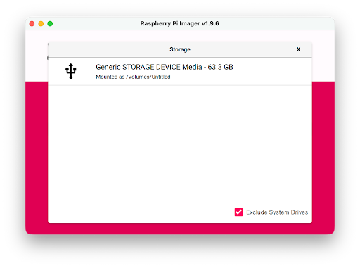
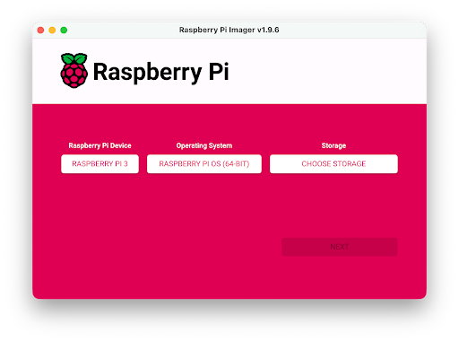
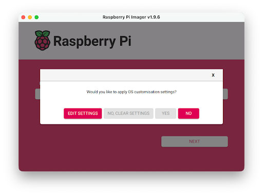
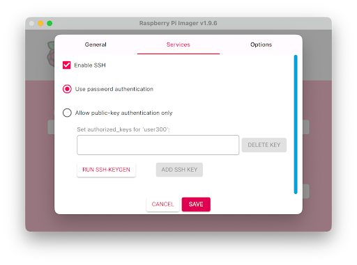
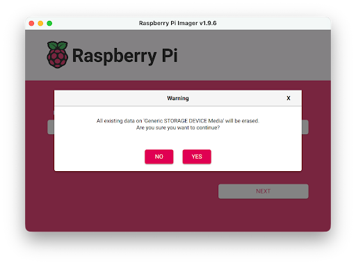
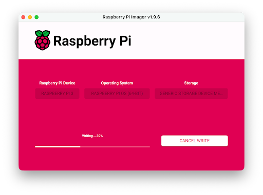
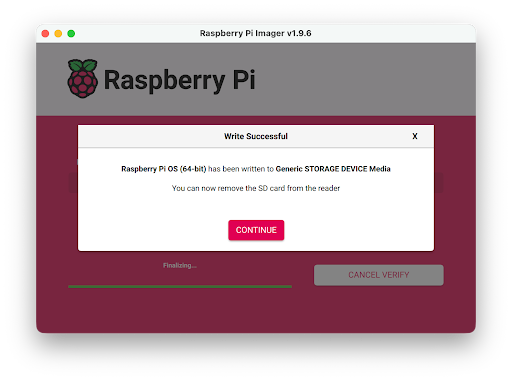
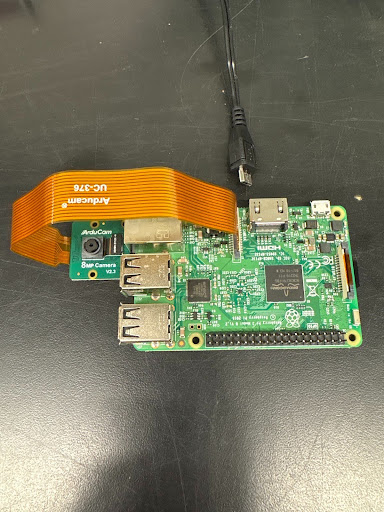

# Setting Up the Phenotyping System (Step-by-Step)

A beginner-friendly guide to building the imaging system from scratch: setting up
a Raspberry Pi, connecting a camera, getting the code running, automating capture,
and syncing images to Google Drive.

> Screenshots and photos are included inline throughout. They show the Raspberry Pi
> Imager screens and the camera wiring on the hardware we used (a Raspberry Pi 3 with
> an ArduCam); your exact screens may differ slightly by model and software version.

---

## 1. Setting up the Pi

**Materials needed:** a Raspberry Pi, a power source, a boot media storage device
(empty microSD card, 32 GB ideally), a separate computer, and an adapter between
that computer and the microSD card.

**Interactive vs. headless.** A Pi can run as an interactive computer (with its own
display, keyboard, and mouse) or as a *headless* computer accessed remotely. We use
headless. For an interactive setup you also need a display, a cable to the Pi, a
keyboard, and a mouse (see the [Raspberry Pi getting-started guide](https://www.raspberrypi.com/documentation/computers/getting-started.html)).

**Powering the Pi.** Plug the power supply into the correct port. We use a Raspberry
Pi 3 Model B, which labels its micro-USB power port "PWR IN." Other models (e.g. the
Pi Zero series) have USB ports shaped like the power port, so read the board's labels.

**Installing the OS on the microSD card.** The Pi has no built-in storage, so the OS
lives on the microSD card (32 GB or more; the Pi supports up to 2 TB). Write it with
the [Raspberry Pi Imager](https://www.raspberrypi.com/software/):

1. Install and open Raspberry Pi Imager on your separate computer (not the Pi).

   

2. Choose your **Device** (we use Raspberry Pi 3).

   

3. Choose the correct **Storage** device. If several are connected, identify it by
   size, or unplug the others until only the target card is listed. (You can pick the
   OS and storage in either order.)

   

4. Choose your **Operating System** — the recommended version at the top of the list.

   

5. When prompted to configure the OS, click **Edit Settings** (recommended; otherwise
   it asks on first boot).

   

   Under **General**, set and write down:
   - **Hostname** — something "raspberrypi"-related.
   - **Username and password** for the admin account.
   - **Wireless LAN** — the SSID and password of the Wi-Fi you're on (the Pi and your
     computer being on the same network is how you first reach it).
   - **Wireless LAN country**, and **locale** (time zone, keyboard).

6. Under **Services**, enable **SSH** and use **password authentication** (public-key
   auth works and is more secure, but is more involved to share among lab members).

   

7. **Options** can be left alone. Click **Save**, then **Yes** to apply to the card,
   then **Yes** to confirm (this erases everything on the card).

   

8. The Imager writes, then verifies (about 7 minutes for us).

   

9. When **Write Successful** appears, eject the card.

   

---

## 2. Opening the Raspberry Pi remotely

1. Insert the microSD card into the Pi and connect power. The LEDs light up (steady
   red, intermittent green); first boot takes a couple of minutes.
2. On your computer, open a terminal (Terminal on macOS) and connect:

   ```
   ssh <user>@<hostname>.local
   ```

   `<user>` is the username you created and `<hostname>` is the hostname you set
   (omit the `<>`). Example: `ssh user@raspberrypi.local`. The `.local` tells your
   computer to look on the local network.

   - "Could not resolve hostname" usually means the Pi is still booting — wait and
     retry, and check the card, power, and LEDs.
   - Answer `yes` to the trust prompt, then enter your password (it won't display as
     you type).
3. Update everything:

   ```
   sudo apt update
   sudo apt full-upgrade
   ```
4. Install **Raspberry Pi Connect** for screen-sharing (removes the need for a
   separate display/keyboard/mouse):

   ```
   sudo apt install rpi-connect
   rpi-connect on
   rpi-connect signin
   ```
5. Open the printed URL in a browser, name the Pi, and sign in to Raspberry Pi
   Connect. Then **Connect via → Screen Share** to get a remote display. You can now
   reach the Pi from anywhere with an internet connection.
6. If reconnecting later fails, unplug/replug the Pi, re-run the `ssh` step, and
   `rpi-connect on` again. Re-running `sudo apt update` (and `full-upgrade` if it
   reports updates) often helps.

---

## 3. Setting up the camera

1. Unpack the camera (we use ArduCams) and remove the protective plastic.
2. With the Pi powered off, insert the ribbon into the connector labeled **CAMERA**.

   
3. Test that the Pi sees the camera:

   ```
   rpicam-hello
   ```

   A 5-second preview should appear (`rpicam-hello --timeout 10000` for 10 seconds).
4. If the camera isn't recognized: check the ribbon alignment, run `sudo apt update`,
   and if needed enable it manually:

   ```
   sudo nano /boot/firmware/config.txt
   ```

   Add this line at the bottom (the overlay is camera-specific; `imx219` is for our
   ArduCam — check your camera's model):

   ```
   dtoverlay=imx219
   ```

   Save, exit, and reboot:

   ```
   sudo reboot
   ```

   Reconnect and run `rpicam-hello` again to confirm.

---

## 4. Taking images

Update the Pi and install the camera library:

```
sudo apt update
sudo apt full-upgrade -y
sudo reboot
sudo apt install -y python3-picamera2
```

---

## 5. Getting the code onto the Raspberry Pi

You can code directly on the Pi (Geany, Thonny) but it's slow. We write code on our
personal computers in VS Code, push to GitHub, and pull it onto the Pi.

1. Install Git on the Pi:

   ```
   sudo apt install -y git
   ```
2. Clone the repository into your project folder (copy the HTTPS link from the green
   **Code** button on the [repo](https://github.com/kyle1686/eckerlabproj)):

   ```
   cd /home/<user>/Project_Folder
   git clone https://github.com/kyle1686/eckerlabproj.git
   ```
3. Enter the repo and run a script (adjust any paths to your Pi first):

   ```
   cd eckerlabproj
   python3 On_Pi/Chamber_Pi/Chamber_Left/chamber_takepicture.py
   ```
4. When the code changes on GitHub, update the Pi with:

   ```
   git pull
   ```

---

## 6. Automating capture with cron

`cron` runs commands at preset times. Edit your crontab:

```
crontab -e
```

(First time: choose option `1` for the simplest editor.) Add a line like:

```
*/20 10-18 * * * /usr/bin/python3 /home/user/your-repo-name/On_Pi/Chamber_Pi/Chamber_Left/chamber_takepicture.py
```

- `*/20` → every 20 minutes
- `10-18` → between 10 AM and 6 PM
- `* * *` → every day of every month
- `/usr/bin/python3` → path to Python 3 (find yours with `which python3`)
- the script path → the capture script for this Pi's camera position

Save (Ctrl+O, Enter), exit (Ctrl+X), and confirm with `crontab -l`. See the repo's
[Crontab Controls](https://github.com/kyle1686/eckerlabproj/blob/main/crontab_controls.md)
doc for more.

---

## 7. Writing the analysis code (JupyterLab + virtual environment)

We write the analysis notebooks in JupyterLab inside a Python virtual environment so
the setup is reproducible and package versions are pinned.

**Install JupyterLab (macOS example; installation differs per OS):**

```
brew install jupyterlab
jupyter lab
```

To open in a specific folder, `cd` there first (in Finder, right-click the folder,
hold Option, "Copy as Pathname"), then run `jupyter lab`.

**Create the virtual environment.** From your Plant Imaging project folder, use
Python 3.12 (plays nicely with PlantCV):

```
brew install python@3.12
brew link python@3.12
python3.12 --version        # expect Python 3.12.x

python3 -m venv plant_env
source plant_env/bin/activate
```

Your prompt changes (e.g. `(plant_env) ...`) when the environment is active. Install
packages:

```
python -m pip install --upgrade pip setuptools wheel
pip install jupyterlab
pip install plantcv
pip install "altair>=5"
pip install ipympl
pip install pandas
# ...etc
```

**Register the environment as a Jupyter kernel** so notebooks run the right Python:

```
python -m ipykernel install --user --name=plant_env --display-name "Plant Imaging Env"
```

In JupyterLab, use **Kernel → Change Kernel → Plant Imaging Env**.

**Everyday reopening:** `cd` to the folder with the venv, `source plant_env/bin/activate`,
then `jupyter lab`. When done, stop JupyterLab with Ctrl+C (then `y`) and run
`deactivate`.

---

## 8. The virtual environment on the Raspberry Pi

```
python3 -m venv plant_env
source plant_env/bin/activate
```

The repo ships a `requirements.txt` that pins every package version (regenerate it on
your laptop with `pip freeze > requirements.txt` and commit it). Inside the cloned
repo on the Pi:

```
git pull
pip install -r requirements.txt
```

To let the venv also use system packages already installed (e.g. `picamera2`):

```
python3 -m venv plant_env --system-site-packages
```

---

## 9. Syncing images through Google Drive

Google Drive is the central store for images and data, reachable from both laptops
and the Pi.

1. Consider making a **dedicated Google account** for the project to keep it separate
   from personal accounts.
2. Install [Google Drive for desktop](https://www.google.com/drive/download/) on your
   computer so Drive appears as a local folder; point a project data folder at it.
3. On the Pi, install and configure **rclone**:

   ```
   sudo apt install rclone
   rclone config
   ```

   Interactive setup: `n` (new remote) → name it `gdrive` → storage type `drive` →
   authenticate the Google account. When it asks for a Client ID, create your own
   (faster than the default) following
   [rclone's guide](https://rclone.org/drive/#making-your-own-client-id):
   - In the [Google API Console](https://console.developers.google.com/), create a
     project (note its name and ID).
   - Under **Enable APIs and Services**, enable the **Google Drive API**.
   - Under **Credentials → Configure Consent Screen → Get Started**: App name
     `rclone`, a support email, Audience **External**, contact email, then finish.
   - Under **Data Access → Add or remove scopes**, add:
     `https://www.googleapis.com/auth/docs,https://www.googleapis.com/auth/drive,https://www.googleapis.com/auth/drive.metadata.readonly`
   - Under **Audience → Add users**, add the project account. Then **Overview →
     Create OAuth client → Desktop app → Create**. Save the Client ID and Secret and
     download the JSON.
   - Under **Audience → Publish App → Confirm**.
   - Back in rclone: paste the Client ID and Secret; choose `1` (full access); leave
     Service Account blank; `n` for advanced config; `y` for auto-config; `n` for
     Shared Drive; save and exit.
4. Move data between the Pi and Drive:

   ```
   # Copy (add) files from the Pi to the Drive:
   rclone copy /home/user/project_folder/google_drive gdrive:Desktop

   # Sync (mirror) instead of copy -- CAREFUL, this overwrites the destination:
   rclone sync /home/user/project_folder/google_drive gdrive:Desktop
   ```

   Prefer `copy` (additions only) over `sync` to avoid accidentally erasing the Drive.
   Schedule the upload with cron to run at the end of each day.

---

## 10. Start-to-finish on a new Pi

Follow, in order: open remotely → set up camera → take images → make your folder
structure → set up GitHub → set up the virtual environment → set up Google Drive.

**When reopening a Pi:**

```
sudo apt full-upgrade -y
# activate the venv:
cd <project_folder> && source plant_env/bin/activate
# update the code:
cd <repo> && git pull
```

If Git reports merge conflicts, do all editing on your laptop and push through GitHub
so no merging happens on the Pi. To hard-reset the repo on the Pi:
`rm -rf your-repo-name` then `git clone <url>` again.

**Example crontab stack (Chamber Left):**

```
05 9  * * * /home/user2/Salk_Project_Folder/plant_env/bin/python /home/.../eckerlabproj/On_Pi/Chamber_Pi/Chamber_Left/chamber_takepicture.py
0  11 * * * /home/user2/Salk_Project_Folder/plant_env/bin/python /home/.../eckerlabproj/On_Pi/Chamber_Pi/Chamber_Left/chamber_takepicture.py
0  13 * * * /home/user2/Salk_Project_Folder/plant_env/bin/python /home/.../eckerlabproj/On_Pi/Chamber_Pi/Chamber_Left/chamber_takepicture.py
0  15 * * * /home/user2/Salk_Project_Folder/plant_env/bin/python /home/.../eckerlabproj/On_Pi/Chamber_Pi/Chamber_Left/chamber_takepicture.py
55 16 * * * /home/user2/Salk_Project_Folder/plant_env/bin/python /home/.../eckerlabproj/On_Pi/Chamber_Pi/Chamber_Left/chamber_takepicture.py
15 17 * * * rclone copy /home/user2/Salk_Project_Folder/Google_Drive/CLeft_Holder gdrive:Chamber/CLeft_Holder
30 17 * * * /home/user2/Salk_Project_Folder/plant_env/bin/python /home/user2/Salk_Project_Folder/eckerlabproj/On_Pi/Chamber_Pi/Chamber_Left/delete_todays_images.py
```

---

## Hardware & cost

**Imaging only**

- Raspberry Pi — ~$50 each ([link](https://www.amazon.com/dp/B082QN6L1N))
- Camera + ribbon — ~$11 each ([link](https://www.amazon.com/dp/B083BHJZ16))
- Power cables

**With soil moisture (optional)**

- Capacitive soil moisture sensors — ~$9 for 5 ([link](https://www.amazon.com/dp/B0BTHL6M19))
- Wire connectors — ~$14 ([link](https://www.amazon.com/dp/B0D56WY37M))
- Breadboards to connect sensors to the Pi — ~$13 for 4 ([link](https://www.amazon.com/dp/B0DZ2FPCNT))

Plus, as needed: mouse, keyboard, monitor, and mounting materials (3D-printed parts,
tape, stands).
